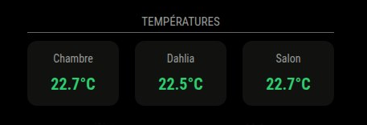

# MMM-TempsHA

MMM-TempsHA is a MagicMirror² module that displays temperature data from Home Assistant in a clean and modern dashboard style.



## Features

- Fetches temperature sensors from Home Assistant via API
- Displays data in a clean card-based layout
- Dynamic color based on temperature:
  - Blue for cold temperatures
  - Green for normal temperatures
  - Red for high temperatures
- Lightweight and fast
- Fully customizable (entities, names, styles)

## Requirements

- Home Assistant instance with API access
- Long-lived access token

## Installation

1. Navigate to your MagicMirror modules folder :
   ```cd ~/MagicMirror/modules```

2. Clone this repository:
   ```git clone https://github.com/cobaye49/MMM-TempsHA.git```

3. Install the module:
```bash
cd MMM-TempsHA
npm install
```

## Configuration

Open your MagicMirror config file:

```bash
nano ~/MagicMirror/config/config.js
```
Add the following :

```js
config: {
  host: "YOUR HA IP",
  token: "YOUR TOKEN",

  entities: [
    {
      entity: "sensor.xxx", //remplace by the sensorID
      label: "name"
    },
    {
      entity: "sensor.xxx", //remplace by the sensorID
      label: "name"
    },
    {
      entity: "sensor.xxx", //remplace by the sensorID
      label: "name"
    }
  ]
}
```

4. Restart MagicMirror:
```bash
   pm2 restart mm
```

## Notes

- Make sure your Home Assistant API is accessible from your Raspberry Pi
- Ensure your token is valid
- Entities must exist in Home Assistant

## Author

Created for personal home dashboard usage.
